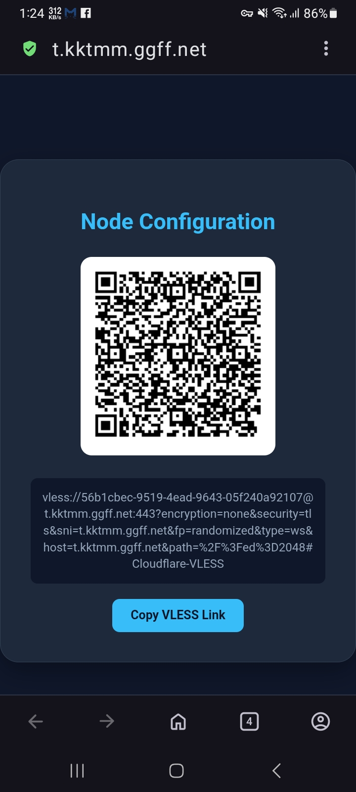

# 🚀 edgetunnel

---

## 📖 Project Overview

**edgetunnel** is an edge computing tunnel solution based on the Cloudflare Workers/Pages platform. It efficiently handles network traffic while providing a robust management panel and flexible node configuration.

- 🖥️ **Demo Site**: [https://EDT-Pages.github.io/admin](https://EDT-Pages.github.io/admin)

### ✨ Core Features

- 🛡️ **Protocol Support**: Native support for VLESS and Trojan protocols with deep encryption integration.
- 📊 **Management Panel**: Built-in visual backend for real-time configuration updates, log viewing, and traffic statistics.
- 🛠️ **Flexible Deployment**: Fully compatible with Cloudflare Workers and Cloudflare Pages (GitHub Sync or Direct Upload).
- 🔄 **Subscription System**: Automated subscription generation and obfuscation, compatible with Clash, Sing-box, Surge, and more.
- ⚡ **Performance Optimization**: Supports custom ProxyIP, SOCKS5/HTTP chain proxies, and Preferred (Selected) APIs for low latency.

---

## 💡 Quick Deployment

### ⚙️ Workers Deployment

1. **Create Worker**: Create a new Worker in your Cloudflare dashboard.
2. **Deploy Code**: Copy the content of `_worker.js` and paste it into the Worker editor.
3. **Set Variables**: Navigate to `Settings` > `Variables` and add:
   - **ADMIN**: Your management panel password.
   - **KV**: (Optional) Bind a KV namespace for persistent storage.
4. **Bind Domain**: Go to `Triggers` and add your custom subdomain (e.g., `vless.yourdomain.com`).

### 🛠 Pages Deployment (Recommended)

1. **Download**: Download the source code as a ZIP file.
2. **Upload**: In Cloudflare Pages, select `Upload assets`, name your project, and upload the zip file.
3. **Environment Variables**: Define **ADMIN** as your management password in the project settings.
4. **Deploy**: Save and deploy the project.
5. **Custom Domain**: Add your CNAME record in the `Custom domains` tab.

---

## 🔑 Environment Variables

| Variable | Required | Example | Description |
| :--- | :---: | :--- | :--- |
| **ADMIN** | ✅ | `MyPassword123` | Backend admin panel login password |
| **KEY** | ❌ | `SecretPath` | Key for quick subscription (Access via `/SecretPath`) |
| **UUID** | ❌ | `90cd4a77-141a...` | Force a fixed UUID (Must be UUIDv4 format) |
| **PROXYIP** | ❌ | `proxyip.net:443` | Global custom Reverse Proxy IP |
| **URL** | ❌ | `https://bing.com` | Camouflage address for the homepage |
| **GO2SOCKS5** | ❌ | `*google.com` | List of domains to force through SOCKS5 proxy |
| **OFF_LOG** | ❌ | `true` | Set to `true` to disable traffic logging |

---

## 🔧 Advanced Usage (Path Parameters)

Switch proxy configurations dynamically via the URL path:

- **Specify ProxyIP**: `/proxyip=your.proxy.ip`
- **Specify SOCKS5**: `/socks5=user:pass@ip:port`
- **Specify HTTP**: `/http=user:pass@ip:port`

---

## 💻 Client Compatibility

- **Windows**: v2rayN, Clash Verge Rev, FlClash, mihomo-party
- **Android**: v2rayNG, ClashMetaForAndroid, FlClash
- **iOS**: Shadowrocket, Surge, Stash
- **MacOS**: Surge, Clash Verge Rev, mihomo-party

---

## ⚠️ Disclaimer

1. This project is intended for **educational and research purposes** only.
2. Users must strictly comply with local laws and regulations.
3. The author is not responsible for any misuse or legal consequences of this code.
4. It is recommended to delete the deployment within 24 hours after testing.

---

